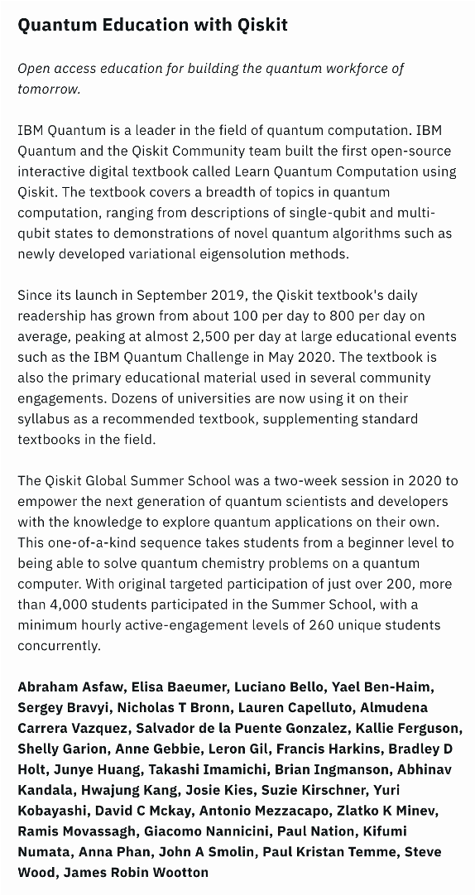

It’s that time of the year again. Hard to believe, but I’ve already been at IBM Quantum for five years. Five years is a long time, especially these days when people switch jobs every year or so. This is my second longest affiliation ever, including my studies and work. The longest was at Nanyang Technological University, where I spent 5.5 years (six-month bridging course, four years undergrad, and a year as a research assistant). I changed primary schools, left my PhD after 3.5 years, so I have never stayed anywhere outside NTU longer than five years.

## A Dramatic Beginning

Five years ago today, I quit my PhD and started my first real job at IBM Quantum. I was still in Singapore. I arrived at the office early, 8 am, got my badge and laptop, met my local manager and teammates. My plan was to hit the ground running: APS March Meeting was happening the next week, followed immediately by Qiskit Camp. I was thrilled to return to Qiskit Camp, which I had attended just a year earlier as a participant. Back then, I built a small game called QPong. Not many people noticed it at the time, but it ended up changing my life forever. This time, I was going back as part of the IBM Quantum organizing team.



My first big project was supposed to be organizing Qiskit Camp Asia 2020 in Singapore—right on top of the iconic Marina Bay Sands. But none of that happened, We all know why: COVID. APS March Meeting was cancelled just days before it was set to start and Qiskit Camp followed. After hosting four Qiskit Camps in 2019 across four continents, we've never had another since.

So, my job started with a dramatic twist, but don't worry, I am not here to write a full autobiography. Instead, let me share a few key highlights from the last five years.

## Highlights

### From IC to Manager and Back

Over these five years, I’ve worked in multiple teams and roles—some by choice, some due to reorganization. I started as an individual contributor (IC), became a manager for a year, and then returned to an IC role. Being a manager was fulfilling. I enjoyed guiding my team, helping them navigate complex situations, and aligning their passions with business goals. But now that I’m back to being an IC, I appreciate having more time for hands-on work and strategic thinking.

Shouldn’t managers focus on strategy? You may ask. Ideally, yes. But in tech companies, managers often juggle two roles: people manager and team lead. People managers handle HR-related tasks—approving leaves, evaluating performance, reviewing salaries, hiring. Team leads define objectives, set strategic directions, and align projects with company goals. These should be separate roles, but when teams are small (<10 people), they often fall on the same person. And doing both well means overworking.

I leaned toward the people management side for a few reasons:

1. we had an organizational change at the same time when I was promoted to be a manager, and my team needed support.
2. I was on intermittent paternity leave and had limited work hours.
3. People management was new to me, so I wanted to improve. 

While my team was happy with me as a manager, externally, I wasn’t always seen as technically strong or strategic. Since returning to an IC role, I’ve led the inaugural IBM Quantum Developer Conference, formed a cross-functional squad to oversee coding challenges, and designed an educational initiative to upskill client ecosystems. With fewer admin tasks, I have more time to focus on technical content and strategic projects. And my experience as a manager wasn’t wasted—I now understand leadership better and feel more prepared if I take on the role again in the future.

### Coding Challenges

My involvement in IBM Quantum Challenges (IQC) and the Qiskit Global Summer School (QGSS) started in 2020 when we introduced these online events to keep our community engaged during the pandemic. These initiatives turned out to be hugely successful, helping Qiskit and IBM Quantum establish a truly global presence.

Over time, I took on a more significant role, eventually forming a dedicated Coding Challenge Squad to oversee the planning of major events, including IQC, QGSS, and the IBM Quantum Developer Conference (QDC). QDC was the closest thing we’ve had to a Qiskit Camp since 2019, and meeting so many Qiskit Advocates in person for the first time was a highlight of my year.

Because of my work on QGSS and IQC, I received O-level (highest level) and A-level achievement awards from IBM Research. It shows that IBM values these efforts, which means a lot to me. 

### Qiskit Advocate Program

As part of the Qiskit Advocate Squad, I helped manage the Qiskit Advocate Program for a couple of years. I designed and launched the [Qiskit Advocate Mentorship Program (QAMP)](https://github.com/qiskit-advocate/qamp-spring-21), which paired advocates worked with IBM experts on software and research projects. These collaborations led to multiple open-source contributions to Qiskit and Qiskit ecosystem, peer-reviewed papers, and, more importantly, helped some advocates kickstart their careers. Some landed jobs at [IBM](https://www.linkedin.com/in/albertomaldonadoromo/), [Google](https://www.linkedin.com/in/ivan-carvalho/), and [IonQ](https://www.linkedin.com/in/splcher/).

### Qiskit open source contributions

I’ve contributed 48 PRs, 14k+ lines of code, and a couple of tutorials/guides, making me one of [the top 40 contributors of all time](https://github.com/Qiskit/qiskit/graphs/contributors?from=2%2F1%2F2017&to=3%2F1%2F2025) (top 10 if [narrowing the time window](https://github.com/Qiskit/qiskit/graphs/contributors?from=1%2F1%2F2022&to=8%2F1%2F2023) to the period (Jan 2022 to Aug 2023) I was very active) to Qiskit. Not a lot, but given that most of these were side projects, I’m incredibly proud.

One contribution I’m particularly proud of is the Fake Provider/Backends. Originally, the `test.mock` module was meant for software testing, but users started using it for benchmarking real hardware results. I led the effort to [migrate it out of the test module](https://github.com/Qiskit/qiskit/pull/8121), introduced [`BackendV2` versions](https://github.com/Qiskit/qiskit/pull/7643), and collaborated with a Qiskit Advocate under QAMP to [generate more robust fake backends](https://github.com/Qiskit/qiskit/pull/10266). These contributions have since been [integrated into qiskit-ibm-runtime](https://github.com/Qiskit/qiskit-ibm-runtime/pull/1140) and later evolved into the local test mode, helping users test their code before running on real quantum hardware.



## Challenges

Of course, not everything is perfect. Sometimes I miss the days of 2019/2020 when we could build fun, experimental things that aligned with our goals of raising awareness of quantum computing and Qiskit.  But as we move toward quantum advantage, I’m excited to help users do meaningful work with quantum computing.

Another challenge? Balancing my dual roles. As an EMEA advocate, I love traveling and running in-person workshops. As a coding challenge lead, I enjoy working with a global team, designing engaging lectures and labs, and staying at the cutting edge of quantum tech. But these two roles sometimes conflict, making life stressful. Still, I like the variety, and I’m figuring out how to make them complement each other. By the end of this year, I should have a better sense of how to integrate them.

## Looking Ahead

Despite changing teams and roles, I’ve stayed true to my mission since the beginning: helping people get into quantum computing. I’m excited about rolling out new educational programs and especially looking forward to the International Year of Quantum. It’s going to be a great year!

## Life Beyond Work

A lot happened outside of work too:

- My two daughters were born.
- Moved from Singapore to Spain.
- Turned 30 (so old!).
- Survived the pandemic (remember that?).
- Became a Spanish citizen.



One goal I haven’t met? Visiting more countries than my age. Five years ago, I was at 23 countries and 27 years old. Now I’m at 28 countries and 32 years old. The same gap remains. But with a Spanish passport and easy EU travel, I should hit this goal soon.

## Games

If you’ve read my past anniversary blogs, there is always a game element. After all, making a quantum video game is how I got into IBM Quantum in the first place.

Can you believe I still haven’t beaten Breath of the Wild? I bought it to celebrate starting this job five years ago, played dozens of hours, defeated a few Divine Beasts—but never finished it. Meanwhile, I got a PS5 for my 30th birthday, played a bunch of AAA games, and recently got tired of them. They demand too much time. So, I’m back to handhelds. Initially, I wanted to mod my OG GBA with a backlit screen but ended up buying a retro handheld clone. Now I can finally play Golden Sun, a game I bought years ago but never played because of the lack of a backlit screen. Hopefully, I’ll finish it this time. Wish me luck!

Until next time.

